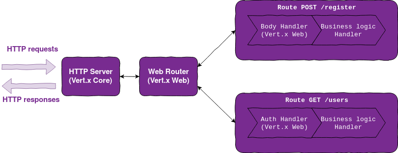
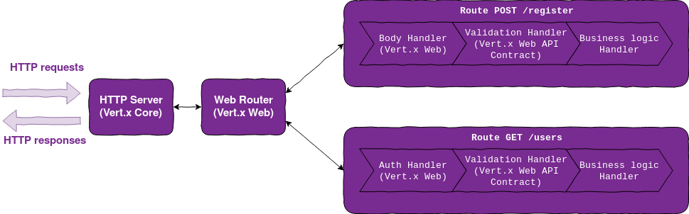
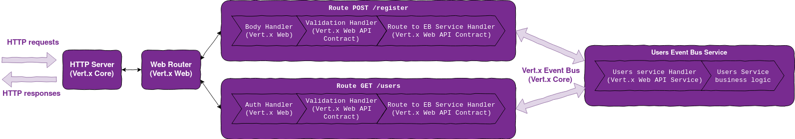
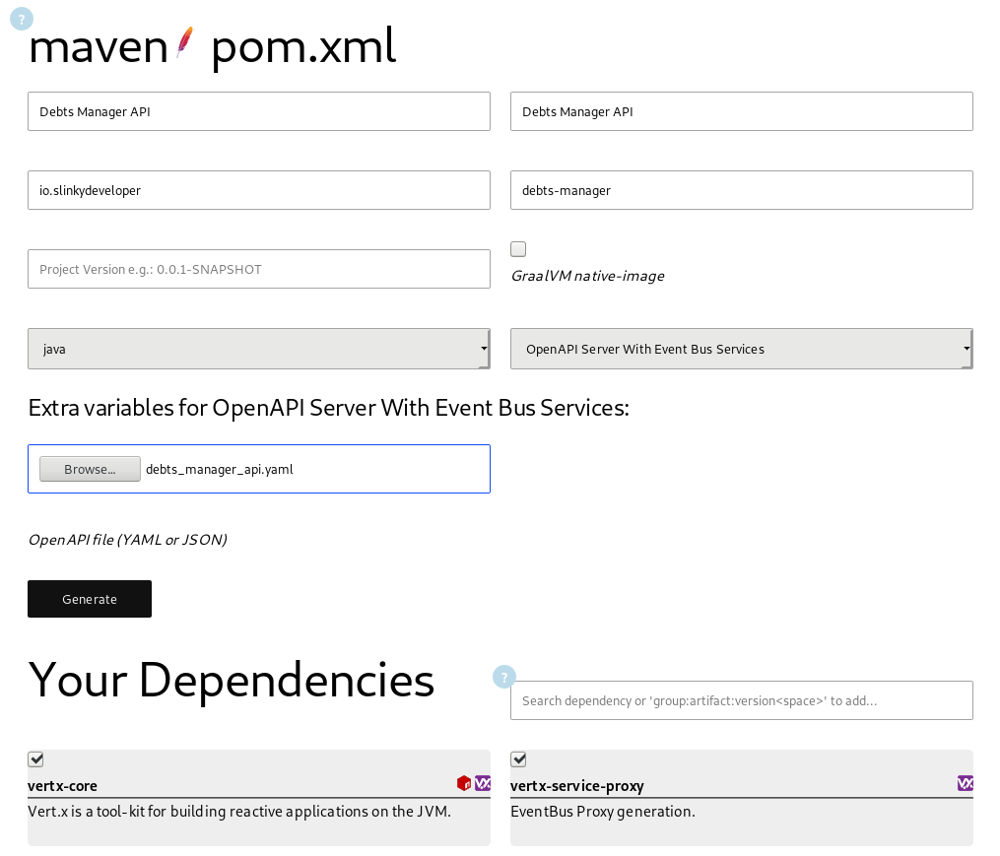
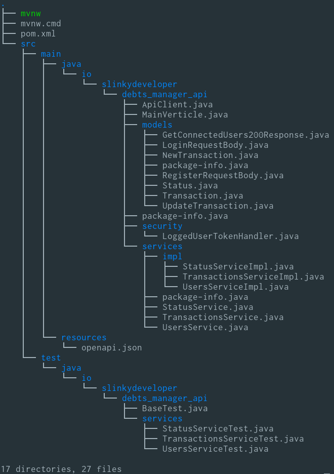

Today I'm going to bootstrap the project starting from the contract I have already created in the [previous chapter](./Debts-Manager-Tutorial-Contract-Design). The aim of this chapter is to show you Vert.x Web, Vert.x Web API Contract and Vert.x Web API Service. The combination of these three packages provides all functionalities you need to create a REST API. Then I'm going to use [pmlopes' vertx-starter](https://vertx-starter.jetdrone.xyz/#maven) to scaffold the project.

If you are new to Vert.x, before going further I strongly suggest you to read [vertx-core documentation](https://vertx.io/docs/vertx-core/java/) and [vertx-web documentation](https://vertx.io/docs/vertx-web/java/)

## Vert.x Web, API Contract and API Services

**Vert.x Web** is a library built on top of Vert.x to create web applications. It provides high level features like routing, request body handling, authorization, etc. The core concept of Vert.x Web is the `Router` which an object that can route requests to one or more `Route`s based on a set of rules like HTTP method, HTTP path, accepted content types, etc. On each `Route` you can define one or more `Handler`s that contain the logic to process the request. When a `Router` receives a request it creates a `RoutingContext` object which has all methods to read the request, write the response, call the next `Handler` and fail the context. Each `Handler` that you register consumes the request's `RoutingContext`. Vert.x Web also provides some common handlers like the `BodyHandler` that parses the request body and the `AuthHandler` that manages authN/Z of the request



**Vert.x Web API Contract** generates a `Router` starting from an OpenAPI definition. Everything revolves around an object called `RouterFactory`: you create the contract, you specify to the `RouterFactory` what are the handlers for the defined operations and it generates the Vert.x Web `Router` for you. The `RouterFactory` does some magics behind the hood to provide you a `Router` that:

- Parses and validates the incoming requests (all kind of parameters and form or json bodies)
- Correctly routes the requests to the right operation handlers by generating the correct `Route` instances
- Has the required security handlers mounted in the right `Route`s



**Vert.x Web API Service** is a code generator based on concept of [Vert.x Service Proxy](https://vertx.io/docs/vertx-service-proxy/java/). An [event bus](https://vertx.io/docs/vertx-core/java/#event_bus) service is a Java interface that helps you to define in a more natural way an event bus message consumer. This approach leads to different benefits like the straightforward process to test a message consumer like any other Java class. As every EB event consumer, a service can inhabit inside the same verticle or it can be deployed in another application somewhere else in your microservices network. You can use the Vert.x Web API Service in order to mix Contract Driven capabilites provided by Vert.x WAC and these event bus service features.
 When you use EB API Services, you don't put the business logic inside the `Route` handlers, but you can distribute it inside different services. Then by using Vert.x WAC, you can manage the linking between these services and the `Router` instance



## Define the API Services

Now I need to define how to group the API Operations defined inside the contract into different API Services. An important thing to keep in mind about API Services is that, _with a good design_, you can turn each API Service into a microservice in a few minutes. Starting from this assumption, I want to group operations by different subdomains of my API. Debts Manager API handles users, transactions and status, so I'm going to organize operations to create a _Users Service_, a _Transactions Service_ and a _Status Service_. Here is the mapping between services and operations:

| Transactions Service | Users Service | Status Service |
|---------------|----------------------|----------------|
| `getTransactions` <br> `getTransaction` <br> `createTransaction` <br> `updateTransaction` <br> `deleteTransaction` | `login` <br> `register` <br> `getConnectedUsers` <br> `connectUser` <br> `getUsers` | `getUserStatus` |

I need to assign an event bus address to each service. The interesting fact is that you can deploy more than one service instance on an address and the event bus will manage the load balancing between these. The event bus address could be any string in any format, although this it makes sense to use a domain like format to identify it. My choice is:

* `TransactionService` is available at `transactions.debts_manager`
* `UsersService` is available at `users.debts_manager`
* `StatusService` is available at `status.debts_manager`

## Specify the services inside the spec

In order to make the `RouterFactory` been able to correcly link the `Router` to the services, it must know what are the services' addresses. To define these associations, you have a couple of [different methods](https://vertx.io/docs/vertx-web-api-service/java/#_mount_to_router_factory). I'm going to focus on the configuration based method: inside the OpenAPI document, for each operation, I define the related service event bus address; then just calling `mountServicesFromExtensions()`, the `RouterFactory` will inspect the OpenAPI document to find all those associations. E.G. the `getTransaction` definition now looks like this:

```yaml
summary: 'Get a Transaction'
operationId: getTransaction
responses: ...
security: ...
x-vertx-event-bus: transactions.debts_manager
```

Look at [`x-vertx-event-bus` documentation](https://vertx.io/docs/vertx-web-api-service/java/#_using_the_extension_code_x_vertx_event_bus_code) for more details.

## Bootstrap the project

`vertx-starter` contains a collection of different project templates called presets. I'm going to focus on _"OpenAPI Server with Event Bus"_ preset to scaffold debts manager.

To help the scaffolder generates the right service interfaces, you must define [the service address - service name mapping](https://github.com/pmlopes/vertx-starter/blob/master/dist/webdocs/OpenAPI_Server_With_Services.md). Just a couple of entries inside Debts manager API spec and you are ready to scaffold the project:

```yaml
components:
  schemas: ...
  securitySchemes: ...
  x-vertx-service-gen:
    transactions.debts_manager: TransactionsService
    users.debts_manager: UsersService
    status.debts_manager: StatusService
```

Now open the [vertx-starter](https://vertx-starter.jetdrone.xyz/#maven) page and with just a couple of clicks you have a zip with the project scaffolded!



Let's dig into the generated code:



The scaffolder created for you:

* The POJOs which represents the API data models
* The service interfaces
* `package-info.java` files required to trigger Vert.x annotation processing
* The stubs of service implementations
* The stubs of service tests
* The entrypoint of Vert.x application which is called `MainVerticle`
* An `ApiClient` that can be used for testing purposes
* The build tool configuration file (`pom.xml` in my case)

As every scaffolder, it is necessary to make some adjustments for the project needs.

## Configure the project

I made a couple of changes to adapt the project skeleton to my needs. In particular I configured in my pom:

* [Logback logging](https://logback.qos.ch/)
* Compilation with Java 11 with `maven-compiler-plugin`
* JUnit 5 with `maven-surefire-plugin`
* [`vertx-maven-plugin`](https://reactiverse.io/vertx-maven-plugin/) to execute and package my Vert.x application

I also substituted the generated `openapi.json` with my original `debts_manager_api.yaml` to keep readibility of the spec document. The generated one is a bundled version with all `$ref`s solved. If you need to bundle again your spec in future, I suggest you to use [Speccy](http://speccy.io/) which is a very good tool that can also convert Json Schema to OpenAPI Schema while bundling the spec.

### `vertx-maven-plugin` and application properties

Vert.x Maven plugin provides a couple of facilities to help you execute and package the Vert.x application. The usage is very simple: you must add it to your build plugins and then you must define the FQCN of the Verticle to run:

```xml
<properties>
  <vertx.verticle>io.slinkydeveloper.debtsmanager.MainVerticle</vertx.verticle>
</properties>
```

```xml
<plugin>
  <groupId>io.reactiverse</groupId>
  <artifactId>vertx-maven-plugin</artifactId>
  <version>1.0.18</version>
  <executions>
    <execution>
      <id>vmp</id>
      <goals>
        <goal>initialize</goal>
        <goal>package</goal>
      </goals>
    </execution>
  </executions>
  <configuration>
    <redeploy>true</redeploy>
    <config>test_config.json</config>
  </configuration>
</plugin>
```

`test_config.json` is a JSON containing application properties like PostgreSQL and Redis connection parameters. Vert.x Core includes this basic support to json configuration files: you can load it into your verticle with Vert.x command line, `DeploymentConfig` or directly with `vertx-maven-plugin`. If you want to configure a more complex properties management, there is a package called [vertx-config](https://vertx.io/docs/vertx-config/java) that enables you to load HOCON configuration files, load configuration from a remote server, etc.

### `MainVerticle`

The generated `MainVerticle` contains two methods:

* `startHttpServer()` to create the RouterFactory, define the various handlers, generate the `Router` instance and start the HTTP server
* `startServices()` to instantiate and mount the event bus services

As I said before, the HTTP Server and the corresponding `Router` don't depend on the event bus services, so you can move these two methods into two separate verticles. For simplicity, I'm going to mantain everything inside one verticle. In next chapters, we will spend time into splitting the verticle.

To mount a service to the event bus I use an helper object called `ServiceBinder` that lookups for the generated message handler and binds the service instance to the event bus:

```java
TransactionsService transactionsService = TransactionsService.create(vertx);
serviceBinder
  .setAddress("transactions.debts_manager")
  .register(TransactionsService.class, transactionsService);
```

As I previously said, the `RouterFactory` can lookup into the OpenAPI document for the associations between services and operations with `mountServicesFromExtensions()`. This makes the code of `startHttpServer()` quite simple for the moment:

```java
private Future<Void> startHttpServer() {
  Future<Void> future = Future.future();
  OpenAPI3RouterFactory.create(this.vertx, "openapi.yaml", openAPI3RouterFactoryAsyncResult -> {
    if (openAPI3RouterFactoryAsyncResult.succeeded()) {
      OpenAPI3RouterFactory routerFactory = openAPI3RouterFactoryAsyncResult.result();

      // Mount services on event bus based on extensions
      routerFactory.mountServicesFromExtensions();

      // Add security handlers
      routerFactory.addSecurityHandler("loggedUserToken", new LoggedUserTokenHandler());

      // Generate the router
      Router router = routerFactory.getRouter();

      // Start the HTTP Server and bind Router
      server = vertx.createHttpServer(new HttpServerOptions().setPort(8080).setHost("localhost"));
      server.requestHandler(router).listen();
      future.complete();
    } else {
      // Something went wrong during router factory initialization
      future.fail(openAPI3RouterFactoryAsyncResult.cause());
    }
  });
  return future;
}
```

### Configure JWT AuthN/Z

Vert.x Web already provides a good support for JWT thanks to [Vert.x Auth JWT](https://vertx.io/docs/vertx-auth-jwt/java/), so I don't need to write an handler that manages the AuthN/Z.

To get JWT running you need an RSA key pair to sign your tokens. I opted for the [JWK](https://tools.ietf.org/html/rfc7517) standard to store it and I generated the key pair and the key store using [mkjwk.org](https://mkjwk.org/).

Vert.x Auth JWT provides `JWTAuth` auth provider, which is the object that can authenticate, authorize and generate tokens. Vert.x Web has an handler called `JWTAuthHandler` that uses this auth provider to validate and extract the payload of the token of incoming requests. I modify the `start()` method of `MainVerticle` to load the jwk from filesystem and create the `JWTAuth`:

```java
loadResource(jwkPath).setHandler(ar -> {
  if (ar.failed()) future.fail(ar.cause());
  else {
    JsonObject jwkObject = ar.result().toJsonObject();
    JWTAuth auth = JWTAuth.create(vertx, new JWTAuthOptions().addJwk(jwkObject));
    startServices();
    startHttpServer(auth).setHandler(future.completer());
  }
});
```

And of course I modify the `startHttpServer()` to use `JWTAuthHandler`:

```java
routerFactory.addSecurityHandler("loggedUserToken", JWTAuthHandler.create(auth));
```

In next chapters you will see how to create a token during the login process.

## Conclusion

The application is bootstrapped, now we are ready to deep down into application logic! In next two chapters I'm going to show you how I have implemented the persistence layer and the event sourcing layer.

Stay tuned for more updates!
