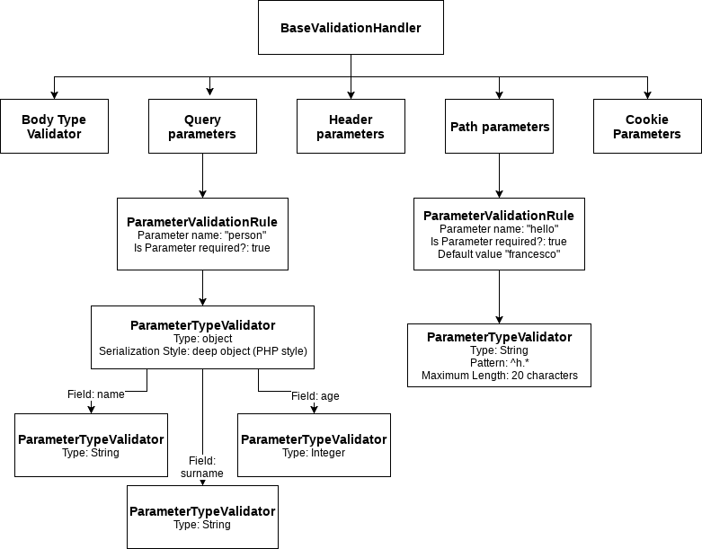

HTTP request validation it's a critical component of my project. HTTP requests validation needs to work well to get working all layers upon. I love to call that _vertx-web validation framework_ (I love the word framework :heart_eyes:)

## Structure of Validation framework
The validation framework is located inside maven module `vertx-web` and package `io.vertx.ext.web.validation`. Following the Vert.x rules, there are Java interfaces for polyglot vertx-web interface and classes inside `io.vertx.ext.web.validation.impl` that implements the logic of the validation.

`HTTPRequestValidationHandler` and `OpenAPI3RequestValidationHandler` (request validator for OAS3) subclass `BaseValidationHandler`, the base class for validation. This class contains a map with parameter names as keys and `ParameterValidationRule` instances as values for every parameter location (query, path, header, cookie, form inside body). Every `ParameterValidationRule` contains a `ParameterTypeValidation`. To simplify things:

* `BaseValidationHandler` validates the request, in fact it iterates through parameters and calls `ParameterValidationRule` methods
* `ParameterValidationRule` abstracts a parameter and validates if parameter exists, if can be empty, ...
* `ParameterTypeValidator` abstracts the parameter type and validates the type



Every exceptions of validation framework are encapsulated inside `ValidationException` class.

## Types of parameters
Most important part of validation is type validation. Type validation take a string or a list of strings as input and gives the parameter correctly parsed as output. I've built a rich set of type validators (mostly to support OpenAPI 3 parameter types):

* `NumericTypeValidator` to validate integers and floating point values
* `StringTypeValidator` to validate strings against a pattern
* `BooleanTypeValidator` to validate booleans
* `JsonTypeValidator` and `XMLTypeValidator` to validate json and xml against a schema
* `EnumTypeValidator` to validate enums
* `ObjectTypeValidator` and `ArrayTypeValidator` to validate objects and array
* `AnyOfTypeValidator` and `OneOfTypeValidator` to validate json schema like `anyOf` and `oneOf`

To instance this classes, there are static methods inside `ParameterTypeValidator`. Of course, user can subclass `ParameterTypeValidator` to create its custom type validator.

I've also created a set of prebuilt instances of this type validators inside `ParameterType` enum, with some common patterns like hostname, email, ...

## Encapsulating parsed parameters
After type validation parameter is parsed and then encapsulated in an object called `RequestParameter`. Every object is mapped into equivalent language type, for example: if we declare a parameter as integer, we receive (in Java) `Integer` object.

When user wants to handle parameters, he can retrieve the `RequestParameters` from `RoutingContext`. `RequestParameters` encapsulate all `RequestParameter` objects filtered by location. For example:

```java
router.get("/awesomePath")
  .handler(superAwesomeValidationHandler)
  .handler(routingContext -> {
  RequestParameters params = routingContext.get("parsedParameters");
  RequestParameter awesomeParameter = params.queryParameter("awesomeParameter");
  Integer awesome = awesomeParameter.getInteger();
});
```

## Arrays, objects and serialization styles
User can declare arrays and objects as parameters. The `ObjectTypeValidator`/`ArrayTypeValidator` provides the deserialization from string, the validation of objects fields/array items with "nested" validators and the encapsulation inside map/list. For example, you can declare a query parameter as comma separated array of integers like this one: `?q=1,2,3,4,5` and you will receive as result a `List<Integer>`.

The serialization methods are implemented as subclasses of `ContainerDeserializer` and there are some prebuilt instances in enum `ContainerSerializationStyle`. Of course, user can use static methods inside `ObjectTypeValidator.ObjectTypeValidatorFactory` and `ArrayTypeValidator.ArrayTypeValidatorFactory` to build this validators, define its serialization style and add the "nested" validators.

## `HTTPRequestValidationHandler`
To start validate the requests, developers can use the `HTTPRequestValidationHandler`. This class exposes methods to add validators without care about `ParameterValidationRule`, because they are automatically generated. For every parameter location `HTTPRequestValidationHandler` exposes three methods:

* `add*Param`: to add a parameter with type taken from `ParameterType` enum
* `add*ParamWithPattern`: to add a string parameter with a pattern
* `add*ParamWithCustomTypeValidator`: to add a parameter with an instance of `ParameterTypeValidator`

Then there are methods for body, like `addJsonBodySchema` or `addMultipartRequiredFile`


Next time I'm going to introduce you the OAS 3 Router Factory, stay tuned!


