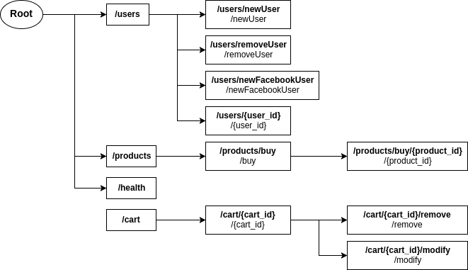
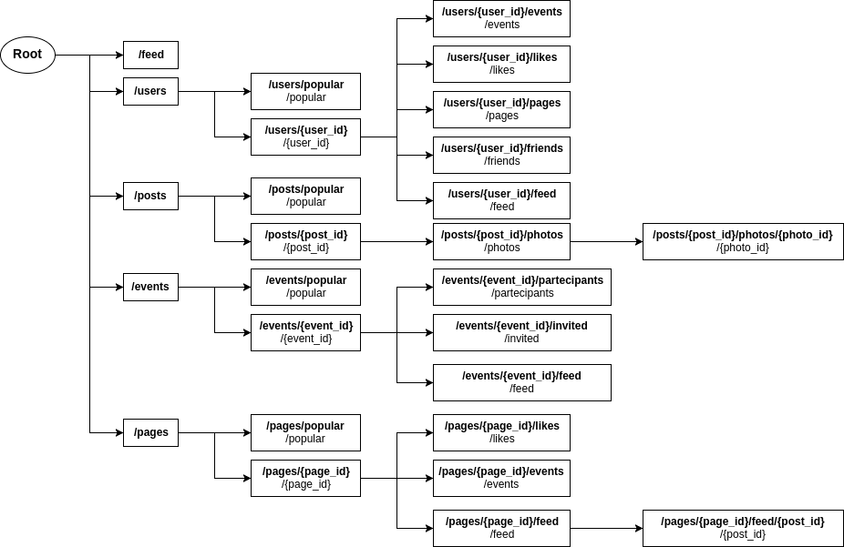
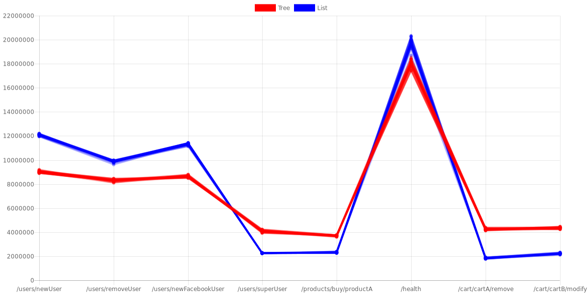
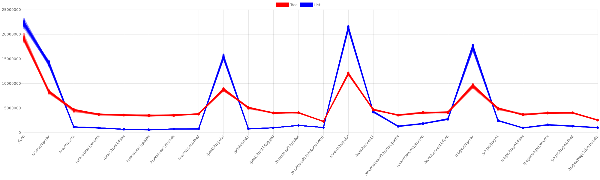
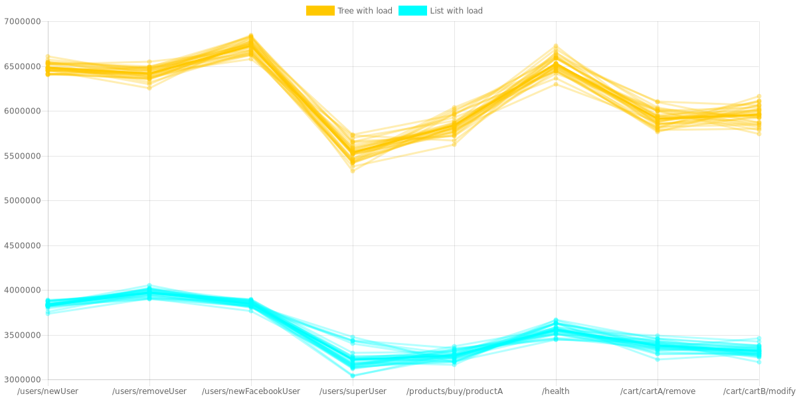
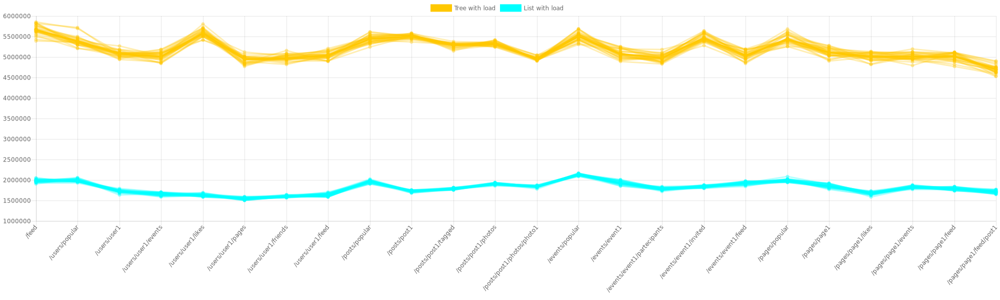
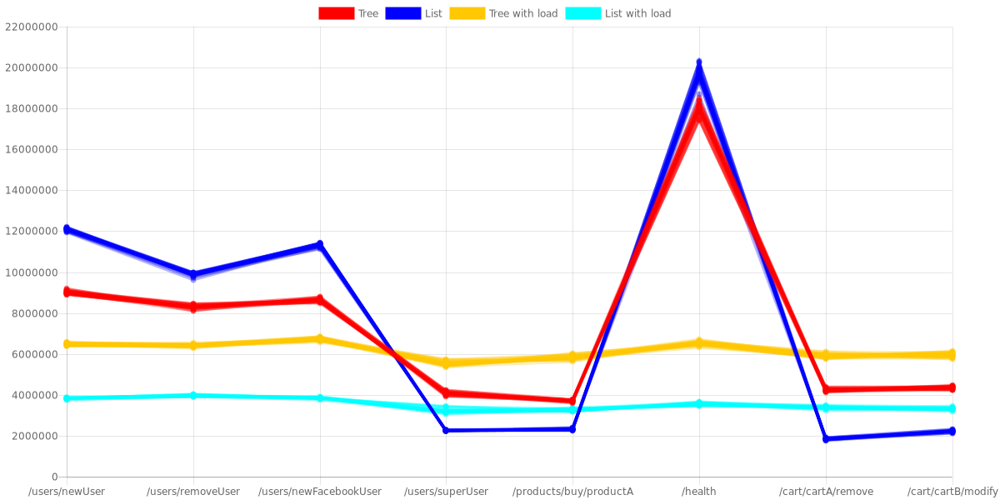
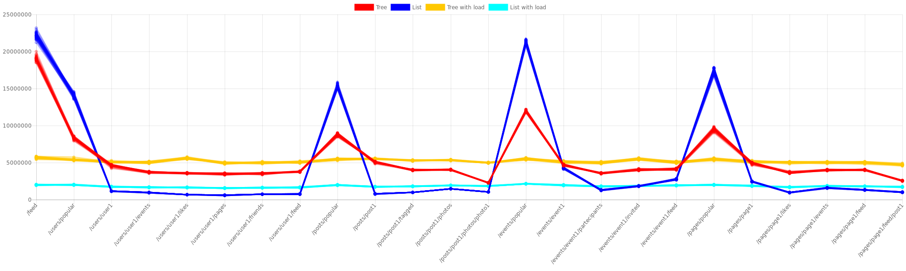
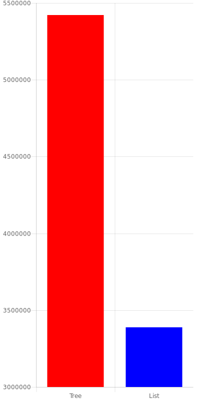
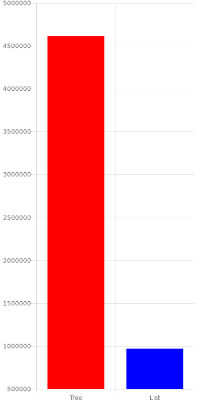

One of the most important features of web frameworks is performance and the routing process can become an important performance killer. I'm going to introduce you a comparison between the list (in particular the skip list) and the tree as data structure for web framework's routers.

## Why this article
Routing consists in calling the correct handler for the URL that user requested. Sometimes this can be a simple and fast process, but in modern scenarios most times this process slows your application, in particular when:

* You have a huge list of routes
* You rely on path parameters (sometimes 2 or more path parameters in the same route)
* You want to run multiple handlers for every URL segment

I'm writing this article because [I want to implement a tree router inside Vert.x Web framework](https://github.com/vert-x3/vertx-web/issues/678), so I'm investigating around to find what the best solution would be.

## List routing vs Tree routing
A __Route__ is a combination of HTTP method and path. The path can be a simple constant path or a path with one or more parameters, managed via regular expressions.

The __list routing__ uses a list to contain all defined routes (in a precise order). When the server receives a request, the router iterates through the list and searches for the routes that match with the received request. This process __cannot be__ a simple list search, because a request can match multiple times. For example: if we have a router that declares

* `GET "/"`
* `GET "/users"`
* `GET "/users/userA"`

and we receive `/users/userA` as request, the router has to run all the handlers of these three routes.

The __tree routing__ differs from list routing for one simple thing: the routes are inside a tree. So when the router receives the request, it follows the tree searching for matching routes

When you think about a website (or, in the same situation, a web API) you think about a tree of web pages (operations) you can retrieve (perform). But most of the web frameworks don't implement the routing as a tree of resources, for multiple reasons:

* It's difficult to build a routing codebase around a concurrent tree preserving good performances
* Does the user manually build the routing tree or is the insertion a task for the algorithm? And how can we manage the regular expressions inside this insertion algorithm?
* Modern lists (for example the SkipList) are really powerful and [can obtain performances similar to trees](https://en.wikipedia.org/wiki/Skip_list) mantaining the routing codebase simple

But, not considering these problems, the tree seems a better solution for this problem, right? This is the starting thesis, now I need to prove it.

Before starting, I want to underline that some frameworks have succesfully implemented the tree routing, for example [Fastify](https://github.com/fastify/fastify), achieving really interesting [performances](https://github.com/fastify/fastify#benchmarks)

## Reproduce the two types of routers
The first step is creating the sketches of these two routing mechanisms. I've tried to create the list routing similar to Vert.x Web router, but of course these are only __simplified examples__. The router of a web framework is more complex than my 50 lines of code. The list router is implemented inside class [`ListRouter`](https://github.com/slinkydeveloper/tree-list-routing-java-bench/blob/master/src/main/java/io/slinkydeveloper/bench/ListRouter.java) and tree router is implemented inside class [`TreeRouter`](https://github.com/slinkydeveloper/tree-list-routing-java-bench/blob/master/src/main/java/io/slinkydeveloper/bench/TreeRouter.java).

The list router has a simple loop that calls for every route the function `route()`; when this function returns true, the route matches perfectly and the routing process stops. Remember that when I check if route _matches_ (both in tree and list scenario) the router:

1. first checks if the path matches partially (in case of regexes it calls `lookingAt()` method, while in string paths it calls the method `startsWith()`)
2. Then it checks if the path matches totally (methods `matches()` and `equals()`). If the path matches totally, the routing stops

The tree routing is a simple recursive function that works as follow:
* Base case: The path chunk is empty so we have finished the routing succesfully
* If not base case: We try to match __partially__ first the constant paths and then the regular expressions. If we found a match, we go deeper with recursion
* If we don't find any match the requested route doesn't exist and the routing process stops

We test against path chunks for a simple reason: when we go deeper with recursion we don't need to test against previous path components (and we don't need to re-extract the parameters), so the router simply removes it from the requested URL. And of course when the string is empty we have finished the routing. To gain good performances inside tree nodes I used the skip lists (I know I've cheated) to contain associated routes.

This is only a way to implement the tree routing and also remember that I haven't written the insertion algorithm for the tree router, so I do all association between nodes manually.

## Two common API scenarios
I've created two benchmarks: an example of ecommerce API and a social network API. This examples are really similar, they only differ in number of routes and how many regular expression are contained in said routes. Below you can see how this "fake" routers are composed.

## Maybe Skip List is better?
The first benchmarks I wrote are simple accesses to routes. I wrote one benchmark for every route (that I store in `compatiblePaths`) and every data structure. Below you can find results of [`ECommerceBenchmark`](https://github.com/slinkydeveloper/tree-list-routing-java-bench/blob/master/src/main/java/io/slinkydeveloper/bench/ECommerceBenchmark.java):

The first observation is that the constant paths in skip list are faster than in the tree router. This is caused by skip list optimization: when we get the same elements multiple times the skip list optimizes its links to access more quickly to its values. But the performances for skip lists falls in favor of tree when we use regular expressions, because of course we give a smaller string to the regular expression engine. With the `/health` path we have a little difference because in tree we are at the first level, while in `/user/newUser` we are one level deeper than `/health`. This results are confirmed by the [`SocialNetworkBenchmark`](https://github.com/slinkydeveloper/tree-list-routing-java-bench/blob/master/src/main/java/io/slinkydeveloper/bench/SocialNetworkBenchmark.java) with the same configuration:

So maybe skip lists are so fast that trees are not competitive in this application field? I've done two considerations:

1. In a real case situation a router doesn't receive **12.000.000 same requests** in one second, but maybe if it receives 1.000 same requests (for example the `/feed` request) the skip list optimization helps a lot
2. My tree implementation is rude compared to JDK's `ConcurrentSkipListSet`

## And if I add some spice?
To confuse the skip list I've created a more _real_ scenario: The benchmark function does 10 random requests and then the request assigned. This process complicates things a bit for the skip list, because it loses the optimization:

And of course it's a win for the tree. The fun fact is that tree defeats the skip list also in first paths.

For the social benchmark the random function that chooses the 10 requests is little bit hacky: Some paths (for example the `/feed`) have more chances than other ones. But the results remain the same:

The results on `SocialNetworkBenchmark` are impressive because with some paths we have 3x or more performances for tree router, but we have an unstable situation at the same level.

There's also an important consideration to do: When we go deeper, tree performances slope down, so to write a good tree router we need a good combination of access optimizations and insertion algorithm that avoids creating uselessly deep nodes.

You can find below the final results with and without load ("with load" values conveniently scaled x11):

## And it's not finished!
For the two test cases and data structures I also wrote a _final benchmark_ that accesses to `compatiblePaths` sequentially and in both cases it's a huge win for tree:

But this is not a very realistic situation, because usually we have a situation like the social network benchmark with load: we have more frequent requests and less frequent requests, but it's unusual to get requests ordered in the router order sequentially.

## So, what's better?
That's an hard question, because these examples don't prove a lot. But, according to this data, it makes sense to start developing a tree router because we have good preconditions. In some situations with regular expressions we have seen up to 2x performances thanks to the tree router, but it's important to get good performances also with constant paths (remember that when we have query parameters like `/user?q=blabla` these URLs are splitted at the start of routing and the router treats this requests like constant paths).

## Implementing a Tree Router: challenging tasks

### Insertion algorithm
The insertion algorithm is the most important challange for different reasons:

1. Providing an optimization at every insertion
2. Splitting constant paths and mostly importantly
3. **Splitting regular expressions**

The idea of insertion is not splitting for every `/` (like I've done in my examples) but something more like this:

1. At the start we have an empty root node
2. When I add a route I assign it to the root node
3. When I add another route I check if it's a child of the root node or if I can split the root node in two nodes. In the first case I simply add the new route inside the list of childs, in the second case I split the root node creating two child nodes and assigning to the root node the shared first part of path

For example:

| Path inserted          | Tree update                                                                      |
|------------------------|----------------------------------------------------------------------------------|
|                        | Empty root node                                                                  |
| /users/{user_id}       | Root node with assigned "/users/{user_id}"                                       |
| /users/addUser         | Root node assigned with "/users/" and with childs "{user_id}" and "addUser"      |
| /users/addFacebookUser | "addUser" splitted in new node with "add" and childs "User" and "FacebookUser"   |

The last task in particular is very tricky, because a simple char to char comparison is very limiting and also can generate not working regular expressions. For example: path `/([a-b]{0, 9})` and path `/([a-z]{0, 9})` cannot be splitted creating a parent node with `/([a`, because of course this regular expression is invalid. I've got some ideas about it:

* First I check if two routes have the same regular expressions in the middle. For example when we have `/users/{user_id}/feed` and `/users/{user_id}/events` we split it into `/users/{user_id}/` with childs `feed` and `events`. This can be done with some regular expressions
* If a regular expression is at the end of a path, I split at the last constant `/` (not inside a group).
* If none of the previous, I treat it as first level child

To do these things maybe a library that helps "understanding" regular expressions could come in handy.

### Mantaining good performances during routing
I really don't have idea how :smile:. I want to start creating a simple router that does only the minimal routing and then I add conditions necessary to successfully pass the tests. Maybe operating in this way I can avoid creation of useless code.

## Conclusions
Router Tree is possible and can give great performances to Vert.x Web. I cannot wait to start working on it!

Stay tuned!
