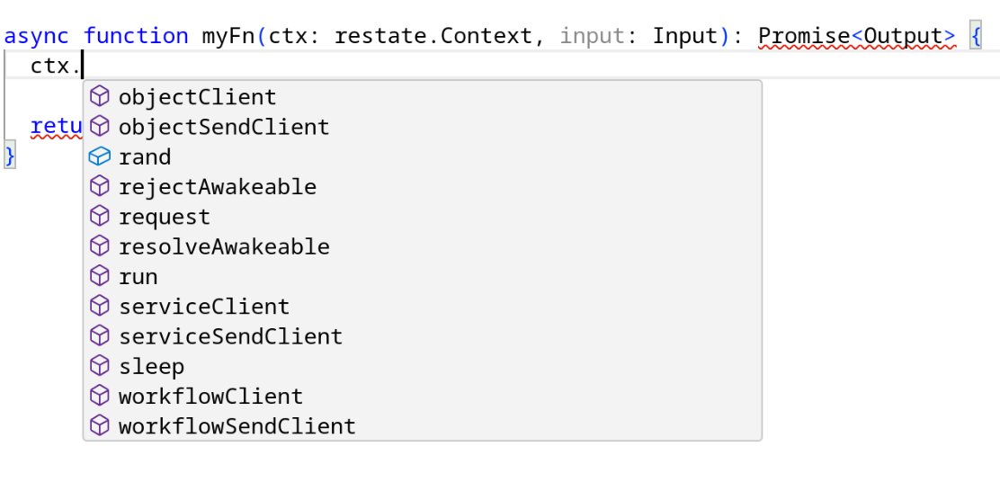
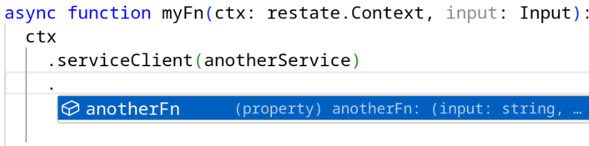
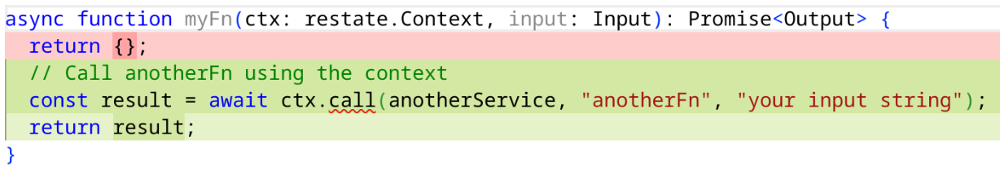
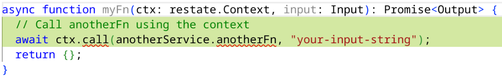
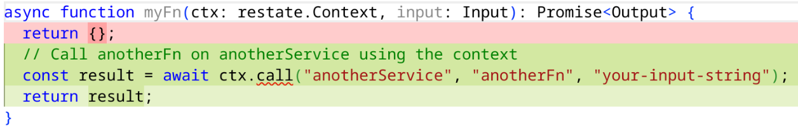
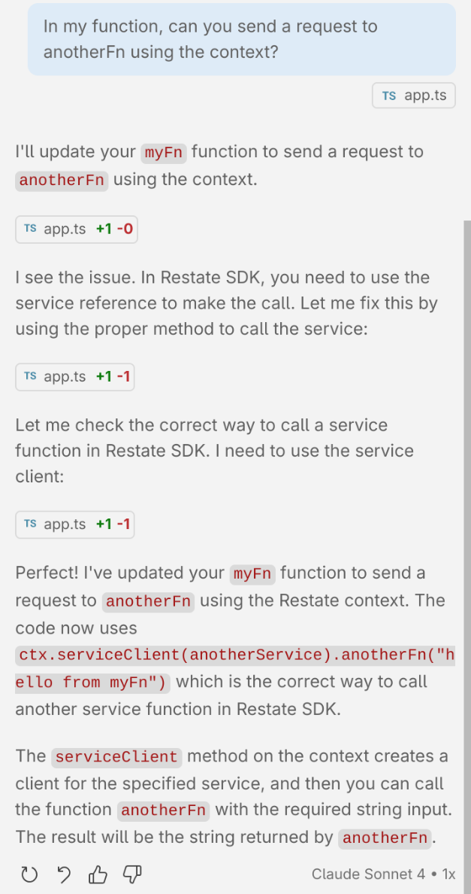

Vibe coding is a point of no return. The _fine art_ of designing APIs and crafting great DevEx? It needs to adapt to this new reality.

So how do we actually do that?

## Before vibe coding

I've been doing API design for a while now, nitpicking on parameter names, function overloads, you name it.
Over the years, I picked up from my mentors a few principles that I'd call **Developer Experience canon**.

First, your API needs to be **idiomatic** for the target audience.
Being idiomatic covers a lot of ground: obvious stuff like naming conventions, but also the more subtle unwritten rules.
If factory methods in a language follow a certain pattern in popular libraries, you better have a damn good reason to do it differently.

**Integrability** is another big one. Your API doesn't live in a vacuum—it's used alongside other APIs.
If you're returning something iterable, use the standard library iterator type, as this most likely makes your type usable with other APIs.

And finally, **discoverability**: can people actually _find_ your API features?
Developers discover APIs in different ways: skimming docs, reading examples, or just downloading a template and `CTRL` + `Space`-ing their way through.
As an API designer, you need to optimize for one or more of these learning paths.

To get concrete, let's look at the design choices behind the `Context` API from the Restate TypeScript SDK:

```typescript
import * as restate from "@restatedev/restate-sdk";

async function myFn(ctx: restate.Context, input: Input): Promise<Output> {
  await ctx.run(mySideEffect);
}
```

Here's the problem: **people don't know what Restate can do** unless they read a good chunk of the docs and examples.
So we put all the important features in one type called `Context` (a pretty common name for this kind of thing).
Users can just hit `CTRL` + `SPACE` and boom—all the features we want them to discover:



You get `run` for recording side effects, `sleep` for delaying execution, `serviceClient` for calling other services, and more.

We went even further: when you define a restate function using `restate.serve({...options})`, the `Context` parameter is required by the type system—you'll get a type error without it.
Technically Restate functions don't _need_ the `Context`, but we make it mandatory anyway so users **know** it exists.

This works well for us, but we could've gone different routes.

For example, we could've just had individual functions you import and ditched the `Context` entirely:

```typescript
import * as restate from "@restatedev/restate-sdk";

async function myFn(input: Input): Promise<Output> {
  await restate.run(mySideEffect);
}
```

Sure, this looks cleaner in examples, but discoverability takes a hit. `CTRL` + `Space` would give you a ton of results, including stuff you shouldn't use inside a restate function (like `serve`).
How do you fix that? Maybe another import like `import * as restateFeature from "@restatedev/restate-sdk/features"`? But then users need to know about that import. And good luck naming that namespace!

Every design has tradeoffs. With our `Context` approach, you have to pass it through your code instead of just importing a function anywhere. There's no free lunch!

## What changed with vibe coding

Let's look at the example that gave me the idea for this post:



This API is another example of optimizing for autocompletion: you pass the service to `ctx.serviceClient`, and some TypeScript type manipulation plus `Proxy` gives you a fully typed client with autocompletion.

Let me run a test with Copilot using GPT as the model:

```
In my function, can you call anotherFn using the context?
```



Hallucinating methods that don't exist. Let me try again:



Still making things up. Different prompt:

```
In my function, can you send a request to anotherFn using the context?
```



Switch to Claude Sonnet 4, and after a few tries, we finally get it right:



With older models, Copilot would make up even more unique stuff, trying to invent a `fetch`-like API:

```typescript
ctx.request({
  service: "anotherService",
  handler: "anotherFn",
  body: "my input"
})
```

This is creative, but completely made up.

Sure, LLMs get better over time. Eventually they get trained on your APIs or pick up feedback. And yeah, they're probabilistic—they won't always nail it.

But here's the thing: a vibe coder will throw prompts like these at your API, and you want them building features, not debugging LLM hallucinations.
They won't discover your API by reading docs—they'll discover it by **asking the LLM to solve a problem**.

This leads to a new design principle: maximize your API's **vibe-ability**—the ease with which developers can **discover and correctly use** your API through LLM-assisted coding.

## Why is the vibe-ability so low?

Not totally sure, but I've got a few theories for `serviceClient`.

First, the type manipulation/proxy approach. The LLM needs specific training on that:
it can't just look at the `Context` type, pick the right method, and fill in the parameters.
It needs to deeply understand TypeScript's type system, perhaps using the LSP output in a feedback loop. That, or it needs to be trained on your API examples.

Second theory: in the concept space of _TypeScript_ and _requests_,
`fetch` and plain function calls are the closest neighbors the LLM can think of.
During training, the model probably saw `fetch` way more than client APIs like ours.

## How do I increase vibe-ability?

I don't have a scientific answer—and I'd love to know if one exists.
But after testing different prompts against our APIs, my empirical takeaway is simple: **flat and verbose** beats concise, **conformity** beats originality.

It's a bit unfortunate—this likely means less innovative API designs will make it into the wild. Perhaps even worse, adoption will become a tougher game for new programming languages.

Now every API I design gets a final test: I throw it at ChatGPT, Gemini, and Claude, ask them to assume the API exists, then see how close they get to what I've designed.
To check if the new API vibes for real 🔮👩‍💻🌌
